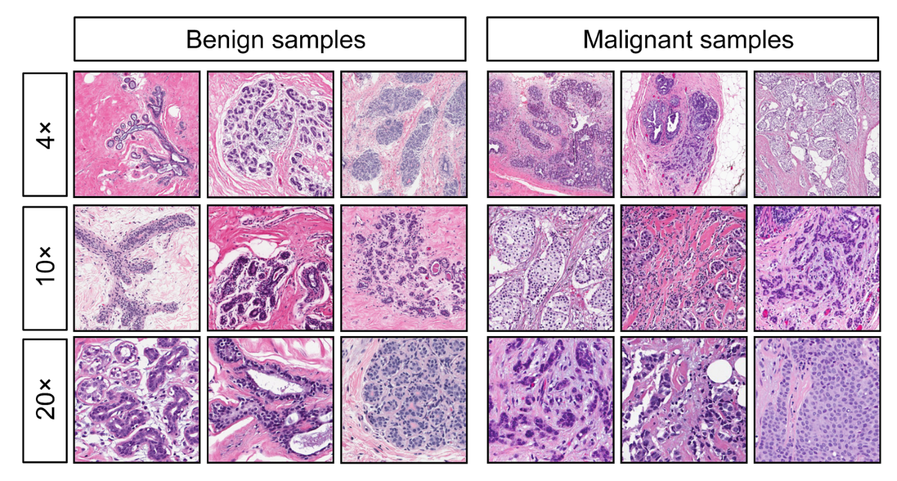

# Introduction 

## Context 

 
One of the biggest causes of mortality among women is breast cancer @ibrahim_feature_2021. The more the detection is delayed, the lower the chance of survival is. That is why efficient diagnosis is critical to provide personalized care and treatment, and to improve cancer outcomes. However, it is quite difficult due to the complexity and diversity of this disease. 

A major concern of the field is to be able to classify the type of tumor with very good accuracy and determine critical features that allow this classification. 

## 1. Information about the dataset 
We propose to study the Wisconsin Breast Cancer Dataset. 

To understand the feature of the selected dataset, we will need first some definitions:

  * According to @noauthor_definition_2011, a tumor is "An abnormal mass of tissue that forms when cells grow and divide more than they should or do not die when they should. Tumors may be benign (not cancer) or malignant (cancer). Benign tumors may grow large but do not spread into, or invade, nearby tissues or other parts of the body. Malignant tumors can spread into, or invade, nearby tissues"

* Specifically, breast cancer is a malignant tumor located in breast cells of the fatty tissues or the fibrous connective tissues within the breast. @noauthor_what_2018 

* "Fine needle aspiration is a type of biopsy procedure. In fine needle aspiration, a thin needle is inserted into an area of abnormal-appearing tissue or body fluid." @hoffman_fine_nodate

{style="float: center;margin-right: 7px; margin-left: 7px;margin-top: 7px; width:60%;"}
  
According to data description, "the features are computed from a digitized image of a fine needle aspirate (FNA) of a breast mass. They describe characteristics of the cell nuclei present in the image. "

There are ten real-valued features computed for each cell nucleus:

Name of the variables    type  Description
----------------------  ----- ---------------------------------------------------------
1) 'radius'              num         distances from center to points on the perimeter
2) 'texture'             num         standard deviation of gray-scale values 
3) 'perimeter'           num         perimeter of the nucleus 
4) 'area'                num         area of the nucleus
5) 'smoothness'          num         local variation in radius lengths 
6) 'compactness'         num         $perimeter^2 / area - 1.0$ 
7) 'concavity'           num         severity of concave portions of the contour 
8) 'concave.points'      num         number of concave portions of the contour 
9) 'symmetry'            num         symmetry of the nucleus 
10)'fractal_dimension'   num         $coastline approximation - 1$
----------------------  ----- ---------------------------------------------------------

The mean, standard error, and "worst" or largest (mean of the three
largest values) of these features were computed for each image,
resulting in 30 features. 
All feature values are recorded with four significant digits.

Note: 
The following analysis has been done with the full dataset. However, the mean of each feature has shown to be more relevant, so we decide to present the analysis only with the mean variables.

[Link to dataset](https://archive.ics.uci.edu/ml/datasets/Breast+Cancer+Wisconsin+%28Diagnostic%29) 

##  2. Question of interest 

The aim is to **predict whether the tumor is benign or malignant with only a few features. **

## 3. Plan of the analysis 

* Inspect the data to understand it better
* Check if the sample proportion of benign and malignant cancer is representative of the whole population 
* Select variables of interest by discarding according to the correlation level 
* Build GLM models and select the best model with anova, question the validity of this model 
* Apply PCA to see to what extent dimension can be reduced and perform a GLM model with relevant dimensions.

In the annex, we build a GLM model with the library "glmnet" and we find a similar selection of variables.

# I. Preprocessing

## 1. Required libraries 
```{r, cache = TRUE, warning = FALSE}
# Check if packages are installed and if not install them
if(!require(pacman)) {
  install.packages(c("pacman", "remotes"))
}
if (!require(papaja)) {
  remotes::install_github("crsh/papaja")
}
if(!require(pacman)) {
  install.packages("equatiomatic")
}
if(!require(devtools)) {
  install.packages("devtools")
  install_github("kassambara/factoextra")
}
if(!require(caret)) {
  install.packages("caret")
}
pacman::p_load(pander,       # Rmarkdown visualization
               GGally, 
               ggfortify,
               ggplot2,
               #MASS,        # for stepAIC
               here,         # to load the path
               kableExtra,   # Rmarkdown table visualization
               papaja,
               glmnet,       # GLM implementation and analysis library
               equatiomatic, # Rmarkdown model equation visualization
               patchwork,    # arrange subplot
               devtools,     # tool for PCA
               factoextra,   # tool for PCA
               caret         # for the confusion matrix
               
)
```
## 2. Import data
```{r, cache = TRUE}
path = here("LUCILE") # get relative path
setwd(path) # set working directory
df <-
  read.csv('data.csv', stringsAsFactors = 1)# load data from github repository
```

Let's delete ID number and the last variable - which is full of NA- because there are not relevant.
```{r, cache = TRUE}
df<-df[,-33]
df<-df[,-1]
```

We will work only with the mean-type data, so let's create a new frame for the variables of this type. 
```{r, cache = TRUE}
df_mean <- data.frame(
  "diagnosis"          = df$diagnosis,
  "radius"             = df$radius_mean,
  "texture"            = df$texture_mean,
  "perimeter"          = df$perimeter_mean,
  "area"               = df$area_mean,
  "smoothness"         = df$smoothness_mean,
  "compactness"        = df$compactness_mean,
  "concavity"          = df$concavity_mean,
  "concave.points"     = df$concave.points_mean,
  "symmetry"           = df$symmetry_mean,
  "fractal_dimension"  = df$fractal_dimension_mean
)
```

## 3. Inspection {.tabset}
### Structure
```{r, comment=NA,cache=TRUE}
str(df_mean)
```

### Head
```{r, comment=NA,cache=TRUE}
pander(head(df_mean))
```

### Summary
```{r, comment=NA,cache=TRUE}
pander(summary(df_mean))
```


## 4. Proportion of benign vs malignant cancer 
```{r, comment=NA,cache=TRUE}
kable(prop.table(table(df_mean$diagnosis)),col.names = 
        c("Type","Frequency"))   
```


The two types of tumors are not represented in the same proportion, this can lead to a bias. 

However, according to  @spivey_predicting_1982 , this proportion seems to be more or less representative of the reality:

"The benign to malignant ratio (B:M ratio) among breast biopsies (number of benign breast lesions divided by number of breast cancers) is widely believed to be around 4:1 or 5:1"


# II. Selection of variables of interest 
We want to remove the variables with high correlation to avoid problems during the modelization.
According to data description, radius, perimeter, area and compactness should be correlated since it exists a formula between these variables. Let's verify that.


## 1. Correlation{.tabset}

### ggpairs

```{r, warning=FALSE, message=FALSE,cache=TRUE}
ggpairs(
  df_mean,
  aes(color = diagnosis, alpha = 0.5),
  upper = list(continuous = wrap(
    "cor", size = 3, alignPercent = 1
  )),
  axisLabels = "none",
  legends = TRUE
) +
  labs(title = " Breath cancer features scatterplot matrix") +
  theme(panel.grid = element_blank(), axis.ticks = element_blank())
```
Description :
  
* On the lower triangular part of the matrix, scatterplots of each pair of features for benign (red) and malignant (blue) types are displayed.
* On the diagonal, the variable distribution is displayed.
* On the upper triangular part, Pearson correlation is displayed.

Observations :
  
* In each subplot a distinction can be made according to the type of 'diagnosis'.
* The observations coming from malignant tumor seem to be in general bigger than the data coming from the benign ones.   

This first observation supports the hypothesis that the value of some features is different according to the type of tumor.

### ggcorr
The following function permits to visualize better the correlation.
```{r, warning=F, cache=TRUE}
ggcorr(df_mean,geom = "text",nbreaks = 5,hjust = 1,label = FALSE,
       label_alpha = 0.7) +
      labs(title = " Breath cancer features Pearson correlation") +
      theme(legend.position ="none")
```


## 2. Variables selection

* As expected, radius, perimeter and area are highly correlated ($r \approx 1$)  

* Surprisingly, concavity, compactness and concave.points have a strong correlation.( $r \approx 0.8$ or $r \approx 0.9$)

Note:

Even if compactness is defined as $perimeter^2 / area - 1.0$ the r between this variable and area or perimeter is not 1 because the correlation shows only the linear dependency and their relationship is not linear.

### Linear models of correlated variables{.tabset}

 We want to discard the variables: perimeter, area, and compactness. To be sure that these variables can be explained by the remaining variables, we set a linear model to express the potential discarded variable according to the other and address the goodness of the model by looking at the adjusted $R^2$.
 
#### Perimeter

```{r, cache = TRUE}
m_perimeter <-
  lm(
    data = df_mean,
    perimeter ~ radius + texture + area + smoothness + compactness + concavity +
      concave.points + symmetry + fractal_dimension
  )
pander(summary(m_perimeter))

```

#### Area

```{r,cache=TRUE}
m_area <-
  lm(
    data = df_mean,
    area ~ radius + texture + perimeter + smoothness + compactness + concavity +
      concave.points + symmetry + fractal_dimension
  )
pander(summary(m_area))
```

#### Compactness
```{r,cache=TRUE}
m_compactness <-
  lm(
    data = df_mean,
    compactness ~ radius + texture + perimeter + smoothness + area + concavity +
      concave.points + symmetry + fractal_dimension
  )
pander(summary(m_compactness))
```

### Variables discarded

The variables area, perimeter, and compactness are well explained by the other variables (the Adjusted R-squared is very close to 1). So we can discard them.

```{r,cache=TRUE}
df_mean_reduc <-df_mean[-c(4,5,7)]
```

# III. GLM

## 1. Set a first GLM model

We set a GLM model with the remaining features. 
Since we want to classify two types of tumors, we use the binomial family.
```{r,cache=TRUE}
m <-
  glm(
    data = df_mean_reduc,
    diagnosis ~ radius + texture + smoothness + concavity + concave.points +
      symmetry + fractal_dimension,
    family = binomial
  )
summary(m)
```


* The algorithm converges: the number of fisher scoring iterations is reasonable.
* There is a lot of variables not significant. To solve this we can try to remove them.
* The ratio of the residual deviance by its degrees of freedom is $153/561 = 0.272$ where the dispersion parameter is 1. There is underdispersion. To solve this we can use the quasibinomial family.


## 2. Model selection{.tabset} 
By performing several anova test, we will see that we can remove the features concavity, symmetry and fractal_dimension, because there is not a significant difference between the model with these variables and the one without.

###  fractal_dimension
```{r,cache=TRUE}
m1 <-
  glm(
    data = df_mean_reduc,
    diagnosis ~  radius + texture + smoothness + concavity + concave.points +
      symmetry,
    family = binomial
  )
summary(m1)
anova(m, m1, test = "Chisq")
```

* The 2 models have a similar AIC
* From the anova test there is no significant difference between the two models 

### symmetry 

```{r,cache=TRUE}
m2 <-
  glm(
    data = df_mean_reduc,
    diagnosis ~  radius + texture + smoothness + concavity + concave.points,
    family = binomial
  )
summary(m2)
anova(m, m2, test = "Chisq")
```
* The 2 models have a similar AIC
* From the anova test there is no significant difference between the 2 models 

### concavity

```{r,cache=TRUE}
m3 <-
  glm(
    data = df_mean_reduc,
    diagnosis ~ radius + texture + smoothness + concave.points,
    family = binomial
  )
summary(m3)
anova(m, m3, test = "Chisq")
```
* The 2 models have a similar AIC
* From the anova test there is no significant difference between the 2 models

### smoothness
```{r,cache=TRUE}
m4 <-
  glm(data = df_mean_reduc,
      diagnosis ~ radius + texture + concave.points,
      family = binomial)
summary(m4)
anova(m, m4, test = "Chisq")
```

* The model without smoothness has an AIC much bigger than the other model
* From the anova test there is a significant difference between the 2 models 
* We cannot remove the feature smoothness of the model.


## 3. Deal with underdispersion
Let's set a GLM model with a quasibinomial family to solve the issue of underdispersion. 

```{r,cache=TRUE}
m_selected_quas <-
  glm(
    data = df_mean_reduc,
    diagnosis ~ radius + texture + smoothness + concave.points,
    family = quasibinomial
  )
(summary(m_selected_quas))
```

The formula of the retained model is: 

```{r,cache=TRUE}
extract_eq(m_selected_quas,use_coefs = TRUE,wrap = TRUE,terms_per_line = 2)
```
 
The ratio of the residual deviance by its degrees of freedom is $160.32/564 = 0.284$ where the dispersion parameter is 0.458.
These two values are close, we can validate this model.

See in annex the diagnostic plot of the retained model and another GLM modelization with glmnet. 

## 4.  Confusion matrix 
First, let's separate the data into train and test sets.
```{r,message = FALSE,cache=TRUE}
# set the seed to make partition reproducible
set.seed(123)

prop_train_test <- floor(0.75 * nrow(df_mean_reduc))

# 0.75 of the data fall randomly into the training set and the remaining is for the test set
train_ind <- sample(seq_len(nrow(df_mean_reduc)), size = prop_train_test) 
train <- df_mean_reduc[train_ind, ]
test <- df_mean_reduc[-train_ind, ]
y_test<- as.numeric(test$diagnosis)-1
```

Built the model with the data of the train set
```{r,cache=TRUE}
m_selected_quas_test <-
  glm(
    data = train,
    diagnosis ~ radius + texture + smoothness + concave.points,
    family = quasibinomial
  )
```

Test the accuracy of the model with the test set by computing the confusion matrix and other statistics. 
```{r,cache=TRUE}
pdata <- predict(m_selected_quas_test, newdata = test, type = "response")
pred <- as.numeric(pdata>0.5)
conf_mat<-confusionMatrix(reference = as.factor(y_test), data = as.factor(pred))
rownames(conf_mat$table) =c("B","M")
colnames(conf_mat$table) =c("B","M")
conf_mat
```
* From the confusion matrix

# IV. PCA
## 1. Variability explained by each PC{.tabset}
In the perspective of predicting breast cancer, we will reduce the dimensionality of the data with the principal components analysis and model it in the space of most relevant principal components. 

```{r, cache=TRUE}
p <- prcomp(df_mean_reduc[,-1], scale=TRUE)
```
Let's see the percentage of variability explained by each principal component.

### Graph

```{r,cache=TRUE}
fviz_eig(p,addlabels = TRUE,geom = c("bar", "line"),barfill = "grey",
         barcolor = "grey",linecolor = "red",ncp = 10) + 
    labs(title = "Percentage of variability explained by each PC",
          x = "Principal Components", y = "Percentage of variances") +
    theme_minimal()
```
 The first four components explain more than 90% of the data. 
 
### Table

```{r, cache=TRUE}
pander(summary(p))
```
 The 4 first components explain more than 90% of the data. 
 
## 2. Observations in PC plans
```{r, cache=TRUE}
autoplot(p,x = 1,y = 2, data = df_mean_reduc,colour = "diagnosis",
  loadings = TRUE,loadings.colour = "blue",loadings.label = TRUE)+
  theme_minimal()
```

By plotting the data in the plan of the first 2 principal components we see a clear separation between benign and  malignant type of cancer. That mean that knowing the location in this plan of a new observation should allow to predict the severity of the cancer. Let's try this approach by applying a GLM model to the first two PC. 

Note:

We tried to plot the data in all the possible pairs formed by the first four components. The clearest separation between the type of cancer occurs in the plan PC1-PC2.
 
## 3. GLM model with PCA
### Implementation
We want to predict 'diagnosis' only with PC1 and PC2 with the help of a GLM model.
We try with the binomial family but as before there is an underdispersion issue. We use the quasibinomial family instead.

```{r, cache=TRUE}
df_mean_pca <- cbind(df_mean_reduc, p$x)
glm_pca <-glm(data= df_mean_pca, df_mean_pca$diagnosis ~PC1+PC2, 
              family = quasibinomial)
```

### Validation

```{r, cache=TRUE}
summary(glm_pca)
```

* The algorithm converges: the number of fisher scoring iterations is reasonable.
* The p-value of the two PC is significant. 
* The ratio of the residual deviance by its degrees of freedom is $162.50/565 = 0.288$ where the dispersion parameter is 0.618.
These two values are close, we can validate this model.

# Conclusion

The goal of this study were to predict whether a tumor is benign or malignant with only a few features.
To do so, we first  implemented a GLM models using the quasibinomial family to avoid underdistribution.  We were able to discard some feature not significant One with the feature of data 

In addition to that we performed a PCA. By reducing the dimensionality of the data, we notice a clear different location in the plan of the two first principal components according to the tumor identity. We then built a GLM model using only these two PCs. This approach permit predict the caner with less variables ( only two ) but is not interpretable. 

resp

*******************************************************************************


# Annex

##  Glmnet{.tabset} 

First, let's separate the data into train and test sets. (This will permit us to be more accurate when we test the goodness of the model)
```{r,message = FALSE,cache=TRUE}
# set the seed to make partition reproducible
set.seed(123)

prop_train_test <- floor(0.75 * nrow(df_mean_reduc))

# 0.75 of the data fall randomly into the training set and the remaining is for the test set
train_ind <- sample(seq_len(nrow(df_mean_reduc)), size = prop_train_test) 
train <- df_mean_reduc[train_ind, ]
test <- df_mean_reduc[-train_ind, ]

x_train <- train[,-1]
y_train <- train$diagnosis
x_test <-  test[,-1]
y_test <-  test$diagnosis
```
Apply GLM with cross validation
```{r, cache=TRUE}
library("glmnet")
tol_length=length(levels(y_train))

cvfit<-cv.glmnet(as.matrix(x_train), y_train,family = "binomial",
                 type.measure="class")
```
Show the misclassification error according to the regularization hyperparameter $\lambda$.
```{r, cache=TRUE}
plot(cvfit)
```
We will now see the for two particular values of this regularization hyperparameter the accuracy of the model with the confusion matrix and which features are retained.

### lambda.min
Let's choose this particular value of $\lambda$ 
```{r, cache=TRUE}
pander(cvfit$lambda.min)
```

The confusion matrix is:

```{r, cache=TRUE}
pander(confusion.glmnet(cvfit, newx =as.matrix(x_test), 
                        newy = y_test, s = 'lambda.min'))
```

The accuracy is very good: 

```{r, cache=TRUE}
assess<-assess.glmnet(cvfit,newx=as.matrix(x_test),
                      newy=y_test, s='lambda.min')
pander(as.numeric(1-assess$class))
```

Let's see the features retained by this model :

```{r, cache=TRUE}
coef(cvfit, s="lambda.min")

```
This model is less conservative than our previous GLM model. Indeed, the variable "smoothness" is not taken into account.  

### lambda.1se

Let's choose this particular value of $\lambda$: 

```{r,cache=TRUE}
pander(cvfit$lambda.1se)
```

The confusion matrix is:
```{r,cache=TRUE}
pander(confusion.glmnet(cvfit, newx =as.matrix(x_test), newy = y_test,
                        s = 'lambda.1se'))
```

The accuracy is very good: 

```{r,cache=TRUE}
assess<-assess.glmnet(cvfit,newx=as.matrix(x_test), newy=y_test,
                      s='lambda.1se')
pander(as.numeric(1-assess$class))
```

Let's see the features retained by this model :

```{r,cache=TRUE}
coef(cvfit, s="lambda.1se")
```
Again, this model is less conservative than our previous GLM model.

# References
```{r, include = F}
#papaja::r_refs(file = "r-references.bib")
#my_citation <- cite_r(file = "r-references.bib", )
# `r_refs()` creates a BibTeX file containing citations for R and all currently loaded packages.
# `cite_r()` takes these citations and turns them into readily reportable text.
# `my_citation` now contains the following text that you can use in your document: `r my_citation`
```
