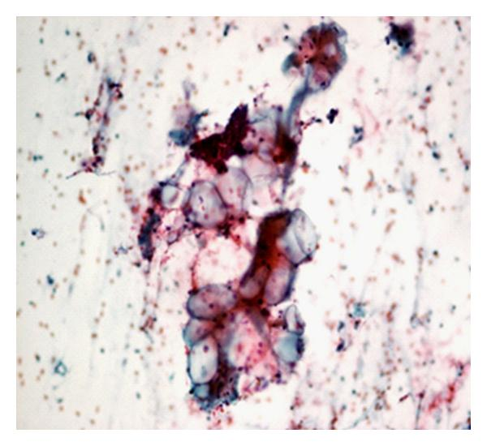

## Setup 

Load libraries
```{r}

# library(GGally)       # for ggpairs
# library(ggfortify)    # for autoplot
# library(ggplot2)      # for ggplot
# library('MASS')       # for the glm model selection 

#this is to check to see if package are installed and if not to install them or just load them if they are installed!
if(!require(pacman)) {install.packages(c("pacman", "remotes"))}
if(!require(papaja)) {remotes::install_github("crsh/papaja")}

pacman::p_load(GGally, ggfortify, ggplot2, MASS, here, kableExtra, papaja)
```

# Information about the dataset

[Link to dataset](https://archive.ics.uci.edu/ml/datasets/Breast+Cancer+Wisconsin+%28Diagnostic%29) \


"Features are computed from a digitized image of a fine needle aspirate (FNA) of a breast mass. They describe characteristics of the cell nuclei present in the image. "
\

{style="float: center;margin-right: 7px; margin-left: 7px;margin-top: 7px; width:40%;"}

$~$
$~$


Ten real-valued features are computed for each cell nucleus:

Name of the variables    type  Description
----------------------  ----- ---------------------------------------------------------
1) 'radius'              num         distances from center to points on the perimeter
2) 'texture'             num         standard deviation of gray-scale values 
3) 'perimeter'           num         perimeter of the nucleus 
4) 'area'                num         area of the nucleus
5) 'smoothness'          num         local variation in radius lengths 
6) 'compactness'         num         $perimeter^2 / area - 1.0$ 
7) 'concavity'           num         severity of concave portions of the contour 
8) 'concave.points'      num         number of concave portions of the contour 
9) 'symmetry'            num         symmetry of the nucleus 
10)'fractal_dimension'   num         $coastline approximation - 1$
----------------------  ----- ---------------------------------------------------------
The mean, standard error and "worst" or largest (mean of the three
largest values) of these features were computed for each image,
resulting in 30 features.
All feature values are recorded with four significant digits.

The aim is to **predict whether the cancer is benign or malignant**

# Preprocessing


Load data
```{r}
#get relative path
path = here("LUCILE")
setwd(path) #set working directory

# df<-read.csv('/Users/lucile/Library/Mobile Documents/com~apple~CloudDocs/STUDY/NEURO/LECTURES/stat/data.csv',stringsAsFactors = 1)

df<-read.csv('data.csv', stringsAsFactors = 1) # j'ai  ajouté le dataset sur github
```


## First look into the data

There are a lot of variables, we should pick the most relevant ones. 

Let's delete the last variable and ID number because there are not relevant.
```{r}
df<-df[,-33]
df<-df[,-1]
```

Let's create a new frame for a the variables of type mean.
```{r, echo = FALSE, comment=NA}
df_mean <-data.frame("diagnosis"          = df$diagnosis,
                     "radius"             = df$radius_mean,
                     "texture"            = df$texture_mean, 
                     "perimeter"          = df$perimeter_mean,
                     "area"               = df$area_mean, 
                     "smoothness"         = df$smoothness_mean, 
                     "compactness"        = df$compactness_mean,
                     "concavity"          = df$concavity_mean, 
                     "concave.points"     = df$concave.points_mean, 
                     "symmetry"           = df$symmetry_mean,
                     "fractal_dimension"  = df$fractal_dimension_mean) 
str(df_mean)


kable(head(df_mean), "latex", booktabs = T) %>%
kable_styling(latex_options = c("striped", "scale_down"))

summary(df_mean)
```


Proportion of benign vs malignant cancer 
```{r, comment=NA}
prop.table(table(df_mean$diagnosis))   
```

The two types of cancer are not represented in the same proportion, this can lead to a bias. Is this proportion representative of the reality ?

"The benign to malignant ratio (B:M ratio) among breast biopsies (number of benign breast lesions divided by number of breast cancers) is widely believed to be around 4:1 or 5:1"   [2]

Blabla citation in parentesis [@james_1890] blbabla, or citation in text @james_1890

## Selection of variables of interest 

According to the description of the data, some variables are likely to be correlated.
We will address this correlation with the mean group of variable.

Hypothesis about the correlation between variables :
*radius and smoothness should be correlated
*radius, perimeter, area and compactness should be perfectly correlated since
  it exists a formula between these variables
* concavity and symmetry should be correlated
* texture and fractal_dimension should not have any correlation 

```{r, echo = FALSE, warning=F, message=F}
ggpairs(data = df_mean,aes(color = diagnosis,alpha =0.5))
levels(df_mean$diagnosis)
```

  By eye, the variables seem to be different according to the type of 'diagnosis' 
  (first row of the plot), the variables coming from malignant cancer seem 
  to be in general bigger than the data coming from bening cancer.
  
  As expected, radius, perimeter and area are highly correlated;  
  and texture and fractal_dimension don't have strong correlation.
  
  Surprisingly, radius and smoothness are not very correlated, 
  and the compactness doesn't show any strong correlation.
  
  Concavity and compactness have a strong correlation.
  In annexe we show that  we have the same correlations with the standard deviation group and extreme group of variable.
  
  The following function permit to see better the correlation :
```{r}
ggcorr(df_mean, geom = "text", nbreaks = 5, hjust = 1, label = TRUE, label_alpha = 0.5)
```
  Even if compactness is define as $perimeter^2 / area - 1.0$ the correlation between this variable and area or perimeter is not 1 because the correlation show only the linear dependency.
The correlation between radius perimeter and area is 1. We will only keep radius.
  
From here let's remove area, perimeter and compactness
```{r}
m_perimeter <-lm(data = df_mean,perimeter~ radius+texture+area+smoothness+compactness+concavity+concave.points+symmetry+fractal_dimension)
summary(m_perimeter)
```
```{r}
m_area <-lm(data = df_mean,area~ radius+texture+ perimeter+smoothness+compactness+concavity+concave.points+symmetry+fractal_dimension)
summary(m_area)
```
```{r}
m_compactness <-lm(data = df_mean, compactness~ radius+texture+ perimeter+smoothness+area+concavity+concave.points+symmetry+fractal_dimension)
summary(m_compactness)
```
The variables area, perimeter and compactness are well explained by the other variables ( Adjusted R-squared very close to 1). So we discard them.

# GLM

```{r}
m <-glm(data = df_mean, diagnosis~ radius+texture+smoothness+concavity+concave.points+symmetry+fractal_dimension,family=binomial)
summary(m)
```
## Validation

```{r}
751.44/153.35
```
Overdistribution ? 

Let's see with an anova test if we can remove symmetry,concavity,concave.points and fractal_dimension 
```{r}
m1 <-glm(data = df_mean, diagnosis~ radius+texture+smoothness+concavity+concave.points+fractal_dimension,family=binomial)
summary(m1)
anova(m,m1,test="Chisq")
m2 <-glm(data = df_mean, diagnosis~ radius+texture+smoothness+concavity+concave.points,family=binomial)
summary(m2)
anova(m1,m2,test="Chisq")
m3 <-glm(data = df_mean, diagnosis~ radius+texture+smoothness+concave.points,family=binomial)
summary(m3)
anova(m2,m3,test="Chisq")

```

## Visualization 


# PCA

*******************************************************************************

# Annexe
## More informations about the dataset

The 3-dimensional space is that described in: [3].

This database is also available through the UW CS ftp server: 
ftp ftp.cs.wisc.edu cd math-prog/cpo-dataset/machine-learn/WDBC/

## Correlation in the 'standard deviation' and 'worst' group

```{r, echo = FALSE, cache=T}
# create a new frame for a the variable of type extreme
df_se <-data.frame("diagnosis"          = df$diagnosis,
                        "radius"             = df$radius_se,
                        "texture"            = df$texture_se, 
                        "perimeter"          = df$perimeter_se,
                        "area"               = df$area_se, 
                        "smoothness"         = df$smoothness_se, 
                        "compactness"        = df$compactness_se,
                        "concavity"          = df$concavity_se, 
                        "concave.points"     = df$concave.points_se, 
                        "symmetry"           = df$symmetry_se,
                        "fractal_dimension " = df$fractal_dimension_se) 
str(df_se)
ggpairs(data = df_se,aes(color = diagnosis,alpha =0.5))

df_extreme <-data.frame("diagnosis"          = df$diagnosis,
                        "radius"             = df$radius_worst,
                        "texture"            = df$texture_worst, 
                        "perimeter"          = df$perimeter_worst,
                        "area"               = df$area_worst, 
                        "smoothness"         = df$smoothness_worst, 
                        "compactness"        = df$compactness_worst,
                        "concavity"          = df$concavity_worst, 
                        "concave.points"     = df$concave.points_worst, 
                        "symmetry"           = df$symmetry_worst,
                        "fractal_dimension " = df$fractal_dimension_worst) 
str(df_extreme)
ggpairs(data = df_extreme,aes(color = diagnosis,alpha =0.5))
```

We get the same results as for the mean group.
  
*****************************************************************************

# References

* [1] https://www.researchgate.net/figure/a-b-Fine-needle-aspiration-cytology-of-the-breast-lesion-showed-singly-lying_fig1_41548857
* [2] https://pubmed.ncbi.nlm.nih.gov/7091922/
* [3] K. P. Bennett and O. L. Mangasarian: "Robust Linear Programming Discrimination of Two Linearly Inseparable Sets", Optimization Methods and Software 1, 1992, 23-34

# Version of R used 

```{r echo = FALSE}
sessionInfo()
```

# References
$~$
$~$
```{r, include = F}
papaja::r_refs(file = "r-references.bib")
my_citation <- cite_r(file = "r-references.bib", )
# `r_refs()` creates a BibTeX file containing citations for R and all currently loaded packages.
# `cite_r()` takes these citations and turns them into readily reportable text.
# `my_citation` now contains the following text that you can use in your document: `r my_citation`

```