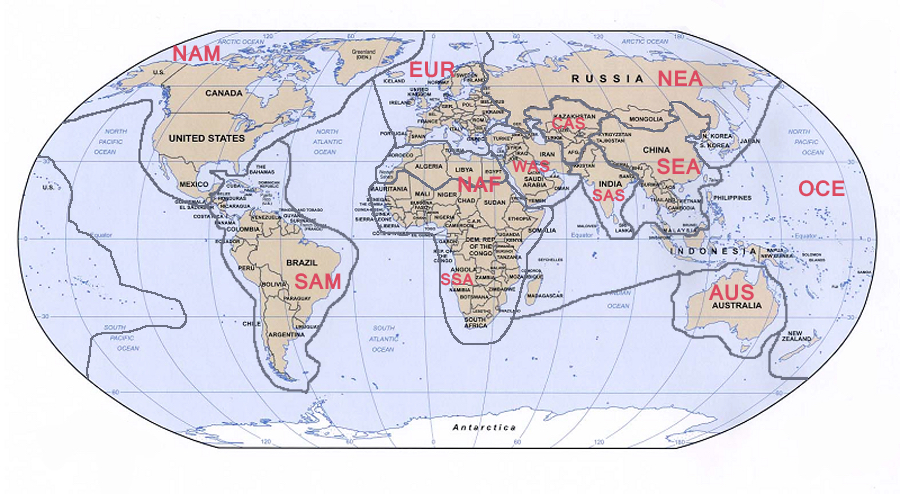

```{r setup, include=FALSE}
knitr::opts_chunk$set(echo = TRUE)
library(ggplot2)
library(GGally)
library(stargazer)
library(ggfortify)
library(rpart)
library(ggdendro)
HLA <- read.table("HLA_dataset.txt", header = TRUE, sep = "\t", stringsAsFactors=1:4)
```

# Introduction

## Context of the project

The major histocompatibility complex (MHC) in humans plays a key role in triggering an immune response (i.e. would lead to the destruction of pathogen-virus-infected cells through presentation of antigenic peptides to _T_-cells; Cambier, Littman, & Weiss, 2001). This complex is located on chromosome 6 in humans, and the genes that compose it are commonly referred to as human leucocyte antigen (HLA). Among these genes, some (HLA-A, -B, -C for class I, and HLA-DPB1, -DRB1, -DQB1 for class II) are known to be particularly polymorphic, and taking into consideration the HLA variation existing in a given human population thus results in recognising a vast set of antigenic peptides.

It is now well accepted that different kind of mechanisms (i.e. stochastic factors related to geographical and demographic expansion of modern humans, and natural selection) influence the evolution of HLA polymorphism (see Sanchez-Mazas, Lemaitre, & Currat, 2012). In fact, geographical factors have been found to influence genetic diversity in humans: in particular, heterozygosity has been shown to decrease as a function of increasing distance from East Africa, thus supporting the "Out-of-Africa" theory of modern humans. Another common theory known as the “pathogen-driven-balancing selection” model posits that heterozygosity on HLA loci allows for higher fitness in pathogen-rich environments. However, the same evolution mechanisms might not be at play for the different classes of HLA molecules since they have different roles in immunity.

In this analysis project, the main focus was on exploring the relation between demographic history of populations (more specifically, their rate of genetic drift) and other variables for loci HLA-DPB1 and HLA-DQB1. These two specific genes are known to bind to other MHC class II genes (namely HLA-DPA1 and HLA-DQA1) to form functional protein complexes critical to elicit an immune response from the body.  

The purpose of exploring these relations was to observe to which extent the investigated models supported one of the two major hypotheses of the evolution of HLA polymorphism presented above. More specifically, the "Out-of-Africa" hypothesis would predict that slower genetic drift is associated with smaller distance from Addis-Abeda; while rapid genetic drift would be associated with less heterozygosity, which would relate to less fitness (operationalised as allelic richness) in pathogen-rich envionments according to the "pathogen-driven-balancing selection" model.

## Data description

For each population in the data set, the following information is available:    

* **Locus**: HLA gene for which the population was sampled
* **Population**: Common name of the sampled population
* **Country**: Country where lives the sampled population
* **Region** (added after pre-processing): Geographical region (EUR: Europe, NAF: North Africa, SSA: Sub-Saharan Africa, WAS: West Asia, SAS: South Asia, CAS: Central Asia, NEA: Northeast Asia, NAM: North America, SAM: South America, SEA: Southeast Asia, OCE: Oceania, AUS: Australia)
* **Demography**: Assumed demographic history of the population, through either rapid genetic drift (RGD), for small-sized and isolated ones, or slow genetic drift (SGD) for the others (large outbred populations)
* **Sample_size**: Numbers of individuals collected to make inference about the population
* **H_expected**: Expected heterozygosity (H) within a sampled population at Hardy-Weinberg equilibrium
* **Num_Diff_Alleles**: Number of different alleles observed in the population
* **Allele_Richness**: Number of different alleles observed in the population with the sample size taken into account
* **Distance_Addis.Abeda**: Distance (in km) for the population from East Africa (taking Addis-Abeda, 9.03 N, 38.74 E as the reference) across landmass, assuming that human populations did not cross large bodies of water during their migration history
* **Pathogen_richness**: Information on pathogen richness of the country, extracted from the GIDEON database which provides information on the presence and the prevalence of infectious diseases by country
* **Virus_pathogens**: Numbers of viruses considered as pathogens
* **Non-Virus_pathogens**: Numbers of non-viruses considered as pathogens    

\    


```{r basic explor, comment = NA}
str(HLA)
```

```{r basic explor tab, results = 'asis', echo = FALSE}
stargazer(HLA, type ="latex", header = FALSE, title = "Summary of HLA data (unprocessed)")
```

\pagebreak   

## Data pre-processing

Populations with problematic data were excluded (typically, expected heterozygosity smaller than 0 or greater than 1, sample size smaller than 50). A subset of the data was then extracted containing only the two loci of interest (HLA-DPB1 and HLA-DQB1). Populations were subsequently grouped by geographical region (see Figure 1) to synthesize information. Subsequent exploratory analysis of the distribution of expected heterozygosity and pathogen richness investigated the genetic validity of that categorisation.  




```{r data preprocessing, include = FALSE}
HLA <- HLA[-which(HLA$Sample_size <= 50 | HLA$H_expected < 0 | HLA$H_expected > 1),]
HLA_sub <- HLA[-which(HLA$Locus != "DPB1" & HLA$Locus != "DQB1"),]
HLA_sub$Country[HLA_sub$Country == "Democratic Republic of the Congo"] <- "Democratic Republic of Congo"
HLA_sub$Region[HLA_sub$Country == "Algeria"] <- "NAF"
HLA_sub$Region[HLA_sub$Country == "Australia"] <- "AUS"
HLA_sub$Region[HLA_sub$Country == "Azores"] <- "EUR"
HLA_sub$Region[HLA_sub$Country == "Bahrain"] <- "WAS"
HLA_sub$Region[HLA_sub$Country == "Belgium"] <- "EUR"
HLA_sub$Region[HLA_sub$Country == "Brazil"] <- "SAM"
HLA_sub$Region[HLA_sub$Country == "Bulgaria"] <- "EUR"
HLA_sub$Region[HLA_sub$Country == "Cameroon"] <- "SSA"
HLA_sub$Region[HLA_sub$Country == "Central African Republic"] <- "SSA"
HLA_sub$Region[HLA_sub$Country == "China"] <- "SEA"
HLA_sub$Region[HLA_sub$Country == "Croatia"] <- "EUR"
HLA_sub$Region[HLA_sub$Country == "Czech Republic"] <- "EUR"
HLA_sub$Region[HLA_sub$Country == "Democratic Republic of Congo"] <- "SSA"
HLA_sub$Region[HLA_sub$Country == "East Timor"] <- "OCE"
HLA_sub$Region[HLA_sub$Country == "Egypt"] <- "NAF"
HLA_sub$Region[HLA_sub$Country == "Ethiopia"] <- "SSA"
HLA_sub$Region[HLA_sub$Country == "Finland"] <- "EUR"
HLA_sub$Region[HLA_sub$Country == "France"] <- "EUR"
HLA_sub$Region[HLA_sub$Country == "Gabon"] <- "SSA"
HLA_sub$Region[HLA_sub$Country == "Georgia"] <- "WAS"
HLA_sub$Region[HLA_sub$Country == "Greece"] <- "EUR"
HLA_sub$Region[HLA_sub$Country == "India"] <- "SAS"
HLA_sub$Region[HLA_sub$Country == "Indonesia"] <- "OCE"
HLA_sub$Region[HLA_sub$Country == "Italy"] <- "EUR"
HLA_sub$Region[HLA_sub$Country == "Japan"] <- "NEA"
HLA_sub$Region[HLA_sub$Country == "Kazakhstan"] <- "CAS"
HLA_sub$Region[HLA_sub$Country == "Kenya"] <- "SSA"
HLA_sub$Region[HLA_sub$Country == "Lebanon"] <- "WAS"
HLA_sub$Region[HLA_sub$Country == "Madagascar"] <- "OCE"
HLA_sub$Region[HLA_sub$Country == "Malaysia"] <- "SEA"
HLA_sub$Region[HLA_sub$Country == "Mexico"] <- "SAM"
HLA_sub$Region[HLA_sub$Country == "Greece"] <- "EUR"
HLA_sub$Region[HLA_sub$Country == "Mongolia"] <- "NEA"
HLA_sub$Region[HLA_sub$Country == "Morocco"] <- "NAF"
HLA_sub$Region[HLA_sub$Country == "New Zealand"] <- "OCE"
HLA_sub$Region[HLA_sub$Country == "Papua New Guinea"] <- "OCE"
HLA_sub$Region[HLA_sub$Country == "Phillipines"] <- "OCE"
HLA_sub$Region[HLA_sub$Country == "Poland"] <- "EUR"
HLA_sub$Region[HLA_sub$Country == "Portugal"] <- "EUR"
HLA_sub$Region[HLA_sub$Country == "Russian Federation"] <- "NEA"
HLA_sub$Region[HLA_sub$Country == "Rwanda"] <- "SSA"
HLA_sub$Region[HLA_sub$Country == "Senegal"] <- "SSA"
HLA_sub$Region[HLA_sub$Country == "Slovenia"] <- "EUR"
HLA_sub$Region[HLA_sub$Country == "South Africa"] <- "SSA"
HLA_sub$Region[HLA_sub$Country == "Spain"] <- "EUR"
HLA_sub$Region[HLA_sub$Country == "Switzerland"] <- "EUR"
HLA_sub$Region[HLA_sub$Country == "Thailand"] <- "SEA"
HLA_sub$Region[HLA_sub$Country == "Tunisia"] <- "NAF"
HLA_sub$Region[HLA_sub$Country == "Turkey"] <- "WAS"
HLA_sub$Region[HLA_sub$Country == "USA"] <- "NAM"
HLA_sub$Region[HLA_sub$Country == "Venezuela"] <- "SAM"
HLA_sub$Region[HLA_sub$Country == "Viet-Nam"] <- "SEA"
HLA_sub$Region[HLA_sub$Country == "Zimbabwe"] <- "SSA"
HLA_sub$Region <- as.factor(HLA_sub$Region)
HLA_sub <- data.frame(HLA_sub[,1:3], HLA_sub$Region, HLA_sub[,4:12])
colnames(HLA_sub)[colnames(HLA_sub) == "HLA_sub.Region"] <- "Region"
colnames(HLA_sub)[colnames(HLA_sub) == "Sample_size"] <- "Sample_Size"
colnames(HLA_sub)[colnames(HLA_sub) == "H_expected"] <- "H_Expected"
colnames(HLA_sub)[colnames(HLA_sub) == "Distance_Addi.Abeda"] <- "Distance_Addis.Abeda"
colnames(HLA_sub)[colnames(HLA_sub) == "Pathogen_richness"] <- "Pathogen_Richness"
colnames(HLA_sub)[colnames(HLA_sub) == "Virus_pathogens"] <- "Virus_Pathogens"
colnames(HLA_sub)[colnames(HLA_sub) == "Non.Virus_pathogens"] <- "Non.Virus_Pathogens"
```

```{r data preprocessed, comment = NA}
str(HLA_sub)
```


\pagebreak  
  

```{r exploratory graph H_expected, message = FALSE, warning = FALSE}
ggplot(data=HLA_sub, aes(x = Region, y = H_Expected)) +
  geom_point(size = 1) +
  facet_grid(~Locus) +
  labs(title = "Expected heterozygosity per region for loci DPB1 and DQB1 of HLA", 
       x = "Region", y = "Expected heterozygosity") +
  theme_light() +
  theme(plot.title = element_text(face = "bold"), axis.text = 
          element_text(colour = "black"), axis.text.x = 
          element_text(angle = 90, vjust = 0.5, hjust = 1))
```
\  
The distribution of expected heterozygosity per region seems to display more variability for locus DPB1 than for DQB1. When looking at the data per region, South America seems to display much more variability than the other regions with a greater range of possible expected heterozygosity. Furthermore, the smallest expected heterozygosity is found in an Oceanian sample (Trobriand Islanders) for locus DPB1, with a value (0.037) that is clearly different from the general tendency in that region. In fact, this population has remained secluded for a very long time, and has underwent rapid genetic drift, which explains such low expected heterozygosity.  
\  

```{r min H_expected, results = 'asis', echo = FALSE}
stargazer(HLA_sub[HLA_sub$H_Expected == min(HLA_sub$H_Expected),-c(6, 8:13)], summary = FALSE, type ="latex", header = FALSE, title = "Smallest expected heterozygosity sample")
```

\pagebreak

```{r exploratory graph Pathogen_richness, message = FALSE, warning = FALSE}
ggplot(data=HLA_sub, aes(x = Region, y = Pathogen_Richness)) +
  geom_point(size = 1) +
  facet_grid(~Locus) +
  labs(title = "Pathogen richness per region for loci DPB1 and DQB1 of HLA", 
       x = "Region", y = "Pathogen richness") +
  theme_light() +
  theme(plot.title = element_text(face = "bold"), axis.text = 
          element_text(colour = "black"), axis.text.x = 
          element_text(angle = 90, vjust = 0.5, hjust = 1))
```

The distribution of pathogen richness per region seems to be approximately similar for both loci of interest, with the greatest values found in South America (for DPB1 and DQB1), and the smallest one found in Europe (for DQB1). Moreover, variability seems to be the greatest in Oceania with a greater range of possible values. Pathogen richness was found to be especially high in Brazilian populations (250, the maximum of the index) which is coherent with the persistent challenge of infectious diseases with new one emerging where old ones were beginning to be controlled and effectively treated (Waldman & Sato, 2016). On the other hand, the small pathogen richness observed in the Azores population might be related to its small size and short history: in fact, the first human inhabitants of the Azores have come in the 15th century.

```{r minmax Pathogen_richness, results = 'asis', echo = FALSE}
stargazer(HLA_sub[which(HLA_sub$Pathogen_Richness == min(HLA_sub$Pathogen_Richness) | HLA_sub$Pathogen_Richness == max(HLA_sub$Pathogen_Richness)), -c(6:10,12:13)], summary = FALSE, type ="latex", header = FALSE, title = "Greatest and smallest pathogen richness samples")
```

Some general observations can also be made: both pathogen richness and expected heterozygosity seem to behave similarly for the two different loci of human leucocyte antigen with approximately the same distribution per region. However, some regions that are represented for one locus of HLA have no available data for the other locus, such as North Africa which is missing for DPB1, and Northeast Asia which is missing for DQB1. It is also worthy of note that the categorisation per region does not seem to be very informative for some specific regions (e.g. South America or Oceania) since data are very variable (maybe due to the greater geographical distance between populations within certain regions).       


\  

```{r exploratory graphs 2g1, echo = FALSE, message = FALSE, warning = FALSE, fig.height = 6, fig.width = 8}
ggpairs(HLA_sub,
        aes(colour = Locus),
        columns = 5:13,
        columnLabels = c("DM","SS", "EH", "NAL", "ALR", "DAA", "PR", "VP", "VNP"),
        diag = list(continuous = wrap("densityDiag", alpha = 0.5)),
        lower = list(continuous = wrap("points", alpha = 0.5, size = 0.5))) +
  labs(title = "Relations between variables in HLA subset", caption = "Legend: Blue: Locus DPB1, Red: Locus DQB1\nVariable labels: DM: Demography; SS: Sample size; HE: Expected heterozygosity; NAL: Number of different alleles;\nALR: Allelic richness; DAA: Distance to Addis-Abeda; PR: Pathogen Richness; VP: Virus pathogen; VNP: Virus non\n-pathogen") +
  theme_light() +
  theme(plot.title = element_text(face = "bold"), axis.text = element_text(colour = "black", size = 7), axis.text.x = element_text(angle = 90, vjust = 0.5, hjust = 1), plot.caption = element_text(hjust = 0))
```

\  

When looking at the relations between all other variables for loci DPB1 and DQB1, there seems to be no major difference between both loci regarding how the variables are distributed, and how they relate to each other. In most of the diagrams, the graphical representations overlap. 

Overall, rapid-genetic-drift samples (upper row, upper boxes) display more variability in their size, have smaller allelic richness, fewer different alleles, a greater distance from Addis-Abeda, and more pathogen richness than slow-genetic-drift samples (upper row, lower boxes).

Some obvious links are observed between number of different alleles and allelic richness, and between pathogen richness and virus pathogen/non-pathogen, since, for both cases, the second variables are functions of the first. In the case of allelic richness, given that this variable is a corrected version of the number of different alleles, it shall be retained for the rest of the analyses.

More worthy of note is the non-linear relation between expected heterozygosity and allelic richness (_r_ = .76), which is sensible given that heterozygosity is defined as difference of alleles for a given locus.


# Data Analysis

## Logistic Regression

According to our initial hypotheses and on our exploratory analysis, generalised linear models were computed to test if HLA Locus, distance to Addis-Abeda, expected heterozygosity, allelic richness, and pathogen richness could account for variability in the rate of genetic drift (__Demography__ variable). The results are displayed in Table 4. The first two tested models contained (1) all the variables mentioned above plus the interaction of allelic richness with pathogen richness, (2) the same model without that interaction. New models were then iteratively computed using only the significant effects of the greater model they are nested in. Even by doing this, the Akaike Information Criterion kept mildly increasing for smaller models (apart from model 1 to model 2). 

```{r models general, include = FALSE}
glm1.1 <- glm(data = HLA_sub, Demography ~ Locus + Distance_Addis.Abeda + H_Expected + Allelic_Richness * Pathogen_Richness, family = binomial)
glm1.2 <- glm(data = HLA_sub, Demography ~ Locus + Distance_Addis.Abeda + H_Expected + Allelic_Richness + Pathogen_Richness, family = binomial)
glm1.3 <- glm(data = HLA_sub, Demography ~ Distance_Addis.Abeda + H_Expected + Pathogen_Richness, family = binomial)
glm1.4 <- glm(data = HLA_sub, Demography ~ Distance_Addis.Abeda + H_Expected, family = binomial)
summary(glm1.1)
```

```{r models general table, results = 'asis', echo = FALSE}
stargazer(glm1.1, glm1.2, glm1.3, glm1.4, title = "Comparison of generalised linear models", type = "latex", header = FALSE, covariate.labels = c("Locus DQB1", "Distance to Addis-Abeda", "Expected heterozygosity", "Allelic richness", "Pathogen richness", "Allelic richness:Pathogen richness"), no.space = TRUE)
```

\  

A formal ANOVA test was conducted to compare the four models (see Table 5). Model 1 and 2 did not significantly differ, which is coherent with the fact that the pathogen richness by allelic richness interaction effect was found to be not significant. Similarily, Model 3 and 4 did not differ. However, a significant reduction in residual deviance was found when comparing Model 2 to Model 3. For that reason, and for the fact that this model displayed the smallest Akaike Information Criterium, the greater model without the interaction of allelic richness with pathogen richness (Model 2) was retained. Diagnostic plots were produced to validate it (see Appendix 1).

```{r models general comparison, comment = NA, include = FALSE}
anov1 <- anova(glm1.1, glm1.2, glm1.3, glm1.4, test = "Chisq")
```

```{r models general comparison table, results = 'asis', echo = FALSE}
stargazer(anov1, title = "Formal comparison of regression models through ANOVA", summary = FALSE, header = FALSE)
```


## Partitioning Method

In addition to a regression modeling approach, the data were partioned using the regression model selected in the previous part with the aim to investigate how well could HLA Locus, distance to Addis-Abeda, expected heterozygosity, allelic richness, and pathogen richness differentiate fast from slow genetic drift. The results displayed here are consistent with the rest of our analyses: the three significant main predictors (Distance to Addis-Abeda, Expected heterozygosity, and Pathogen richness) are the most useful in partioning the data.

\  

```{r partioning, echo = FALSE}
part <- rpart(Demography ~ Locus + Distance_Addis.Abeda + H_Expected + Allelic_Richness
              + Pathogen_Richness, data = HLA_sub, method = "class")
part_tree <- dendro_data(part)
ggplot() +
  geom_segment(data = part_tree$segments, aes(x = x, y = y, xend = xend, yend = yend)) +
  geom_text(data = part_tree$labels, aes(x = x, y = y, label = label), size = 3.5, 
            vjust = 1.5, colour = "red") +
  geom_text(data = part_tree$leaf_labels, aes(x = x, y = y, label = label), size = 3, 
            vjust = 1.5) +
  theme_dendro()
```


# Conclusion

The present data analysis was aimed at exploring the relation between rate of genetic drift and other genetic characteristics of populations with the more general objective to better understand the evolution mechanisms of human leucocyte antigen. The data analysed in fact supported one specific model: it was observed that the probability that a sample underwent a slow genetic drift decreased as a function of distance to Addis-Abeda (Appendix 2, Plot 1), supporting the "Out-of-Africa" model. Even though this might be true, some specific samples (such as the Pygmies Aka, discussed in Appendix 2) did not follow this relationship. In fact, genetic drift rate is not strictly under dependence of geographical effects: populations close to the "origin point" might have rapidly been re-sampled and secluded in their history, having them undergo a fast genetic drift. However, geographical information seems to provide an excellent partioning point to differentiate the rate of genetic drift of a given population.

The present project also sought to ascertain the relevance of the "pathogen-driven-balancing selection" model to understand evolution mechanisms of HLA genes. It was also observed that the probability of slow genetic drift increased as a function of expected heterozygosity (Appendix 2, Plot 2), allelic richness (Appendix 2, Plot 3), but decreased as a function of pathogen richness (Appendix 2, Plot 4). Allelic richness and pathogen richness were not found to interact, which would have been expected given the hypothesis that higher allelic richness would be associated with slower genetic drift only in rich pathogen environments. However, the partioning method yielded intersting information: slow genetic drift did happen more frequently for low expected heterozygosity - low pathogen richness samples. The lack of information about allelic richness (operalisation of fitness) does not permit to decide if these observations are relevant to the "pathogen-driven-balancing selection" model tested here. Overall, the data reported here could not support this model of the evolution mechanisms of HLA genes.

In summary, it seems that genes HLA-DPB1 and HLA-DQB1 of the major histocompatibility complex in humans follow a stochastic evolution process under the main influence of geographical migration, supporting the "Out-of-Africa" model of the evolution of anatomically modern humans.

\pagebreak

# Appendices

## Appendix 1: Diagnostic plots

```{r models general diagnostic}
autoplot(glm1.2, 1:6)
```
\ 

According to the diagnostic plots, there seems to be no extreme values (Cook's distances are well below 1). Note that it is not possible to check for homoscedasticity since we do not know the expected distribution of residuals.

\pagebreak

## Appendix 2: Fitted probability of rapid genetic drift

Note that the following representations only express the link between pairs of variables and do not account for the full model explored in the present data analysis project. However, they remain a useful tool to visually represent how the different variables explored influence the probability that a population underwent a rapid or slow genetic drift. See comments under plots 1 and 4. Note that the model curve is not displayed in the following graphs since they hinder the readability of the plots in some cases (e.g. negative probabilities).

\  

```{r models general graph 1}
ggplot(data = HLA_sub,
       aes(x = Distance_Addis.Abeda, y = fitted(glm1.2))) +
  geom_point() +
  labs(title = "1. Probability of slow genetic drift as a function of distance to \n
    Addis-Abeda", 
       x = "Distance to Addis-Abeda", y = "Probability of slow genetic drift") +
  theme_light() +
  theme(plot.title = element_text(face = "bold"), axis.text = 
          element_text(colour = "black"))
```

A noticeable feature of the graphical representation of the probability of slow genetic drift as a function of distance to Addis-Abeda is the presence of values that do not follow the logistic s-shaped curve of the regression model, which is less the fact for the two following graphical representations: in fact, at least one data point clearly falls outside the model's shape with a distance to Addis-Abeda of approximately 2'500 kilometers and a SGD probability of .13.

```{r find outlier, results = 'asis', echo = FALSE}
HLA_sub <- cbind(HLA_sub, fitted(glm1.2))
colnames(HLA_sub)[colnames(HLA_sub) == "fitted(glm1.2)"] <- "Fitted"
stargazer(HLA_sub[which(HLA_sub$Distance_Addis.Abeda < 5000 & HLA_sub$Fitted < .25),-c(4:9,11:13)], summary = FALSE, type ="latex", header = FALSE, title = "Outlier data point for selected regression model")
```

The sample in question was extracted from the Pygmy Aka population in Central African Republic (Sub-Saharian Africa) which underwent a remarkably rapid genetic drift despite its proximity to Addis-Abeda. Indeed, the particularity of its phenotype (Pygmies are relatively small in height compared to other populations) may be a consequence and proof of the fast genetic drift they underwent (with a possible "Founder effect" that selected a very specific phenotype that quickly differentiated from other populations). In fact, the logistic regression model did not fail to categorise this sample as having a low probability of slow genetic drift.

\  

```{r models general graph 2}
ggplot(data = HLA_sub,
       aes(x = H_Expected, y = fitted(glm1.2))) +
  geom_point() +
  labs(title = "2. Probability of slow genetic drift as a function of expected 
       heterozygosity", 
       x = "Expected heterozygosity", y = "Probability of slow genetic drift") +
  theme_light() +
  theme(plot.title = element_text(face = "bold"), axis.text = 
          element_text(colour = "black"))
```

\pagebreak

```{r models general graph 3}
ggplot(data = HLA_sub,
       aes(x = Allelic_Richness, y = fitted(glm1.2))) +
  geom_point() +
  labs(title = "3. Probability of slow genetic drift as a function of allelic richness", 
       x = "Allelic richness", y = "Probability of slow genetic drift") +
  theme_light() +
  theme(plot.title = element_text(face = "bold"), axis.text = 
          element_text(colour = "black"))
```

\pagebreak

```{r models general graph 4}
ggplot(data = HLA_sub,
       aes(x = Pathogen_Richness, y = fitted(glm1.2))) +
  geom_point() +
  labs(title = "4. Probability of slow genetic drift as a function of pathogen richness", 
       x = "Pathogen richness", y = "Probability of rapid genetic drift") +
  theme_light() +
  theme(plot.title = element_text(face = "bold"), axis.text = 
          element_text(colour = "black"))
```

The lack of information provided by pathogen richness in discriminating between slow and genetic drift is not very surprising since this predictor was only found to be significant in the greater model without interaction. However, it is puzzling that the partioning analysis chose this variable over allelic richness which offers a much better discrimination between slow and rapid genetic drift.

\pagebreak

# References

* Cambier, J. C., Littman, D. R., Weiss, A. (2001). Antigen presentation to T lymphocytes. In C. A. Janeway, P. Travers, M. Walport & M. J. Shlomchik (Eds.), _Immunobiology: The Immune System in Health and Disease_ (pp.186-218). New York: Garland Publishing.  

* Genetics Home References (2018, January 18). Genes [Section name]. Retrieved from https://ghr.nlm.nih.gov/gene.
  
* Sanchez-Mazas, A., Lemaitre, J.-F., & Currat, M. (2012). Distinct evolutionary strategies of human leucocyte antigen loci in pathogen-rich environments. _Philosophical Transactions of the Royal Society_, _367_, 830-839.

* Waldman, E. A., & Sato, A. P. S. (2016). Path of infectious diseases in Brazil in the last 50 years: An ongoing challenge. _Revista de Saúde Pública_, 50-68.

\pagebreak

# Session Information

```{r session info, echo = FALSE, comment = NA}
sessionInfo()
```

